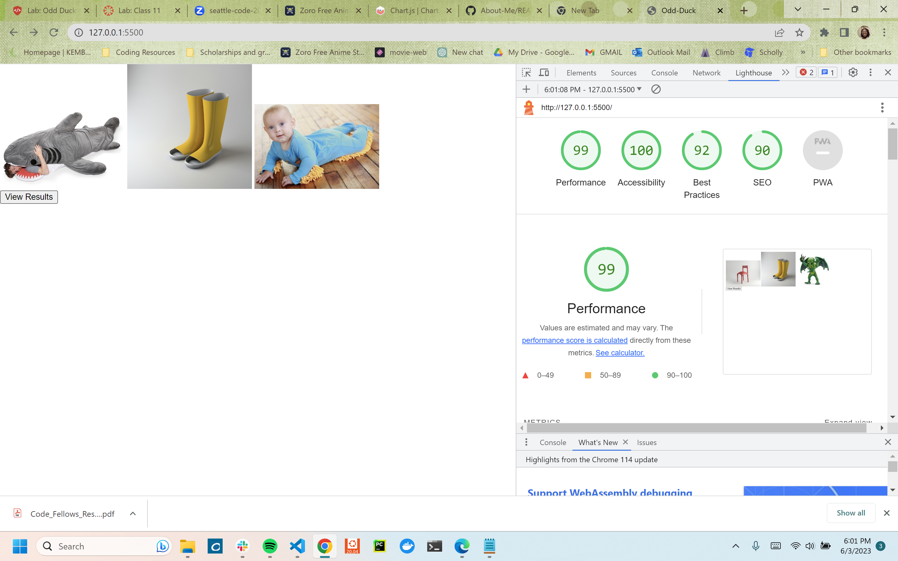

# odd-duck
Code 201: Labs 11 - 13
Code 201: Labs 11 - 13

## Odd Duck
This app allows the user to vote on the product of their choosing, counting the number of votes each product recieves and how often it is presented, using data visualization to display the results of the voting back to the user using. Key features of this app include:
    - Products are displayed using a random generator
    - Products already displayed will not be generated on the subsequent generation
    - Each product generated in a round is unique, there will never be a product that appears twice in the same round of voting

### Author: Ariania Palmer

### Links and Resources

* [Built using Chart.js](https://www.chartjs.org/docs/latest/)
* [Styled in tandem with Myer Web's reset stylesheet](http://meyerweb.com/eric/tools/css/reset/)

### Lighthouse Accessibility Report Score

* Accessibility score

### Reflections and Comments

#### Lab 11 Reflection:
